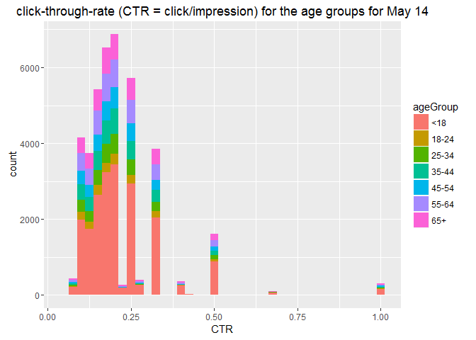

# NYT_AD-Click_Analysis
Manjula Kottegoda  
June 27, 2016  


## Data Prep for Live Session 8
#### Module 8.9

Download the clickstream data from <http://stat.columbia.edu/~rachel/datasets/nyt13.csv>. And load to a Dataframe.


```r
# Load data to a Data frame
#NYT_DF13 <- read.csv("Analysis/Data/nyt13.csv",blank.lines.skip=TRUE)
#NYT_DF13 <- read.csv(url("http://stat.columbia.edu/~rachel/datasets/nyt1.csv"))
NYT_DF13 <- read.csv("Analysis/Data/nyt1.csv",blank.lines.skip=TRUE)
head(NYT_DF13) # Examine 1-5 records of Data frame
```

```
##   Age Gender Impressions Clicks Signed_In
## 1  36      0           3      0         1
## 2  73      1           3      0         1
## 3  30      0           3      0         1
## 4  49      1           3      0         1
## 5  47      1          11      0         1
## 6  47      0          11      1         1
```

```r
str(NYT_DF13) # Examine structure of Data frame
```

```
## 'data.frame':	458441 obs. of  5 variables:
##  $ Age        : int  36 73 30 49 47 47 0 46 16 52 ...
##  $ Gender     : int  0 1 0 1 1 0 0 0 0 0 ...
##  $ Impressions: int  3 3 3 3 11 11 7 5 3 4 ...
##  $ Clicks     : int  0 0 0 0 0 1 1 0 0 0 ...
##  $ Signed_In  : int  1 1 1 1 1 1 0 1 1 1 ...
```

```r
summary(NYT_DF13) # Examine summery of Data frame
```

```
##       Age             Gender       Impressions         Clicks       
##  Min.   :  0.00   Min.   :0.000   Min.   : 0.000   Min.   :0.00000  
##  1st Qu.:  0.00   1st Qu.:0.000   1st Qu.: 3.000   1st Qu.:0.00000  
##  Median : 31.00   Median :0.000   Median : 5.000   Median :0.00000  
##  Mean   : 29.48   Mean   :0.367   Mean   : 5.007   Mean   :0.09259  
##  3rd Qu.: 48.00   3rd Qu.:1.000   3rd Qu.: 6.000   3rd Qu.:0.00000  
##  Max.   :108.00   Max.   :1.000   Max.   :20.000   Max.   :4.00000  
##    Signed_In     
##  Min.   :0.0000  
##  1st Qu.:0.0000  
##  Median :1.0000  
##  Mean   :0.7009  
##  3rd Qu.:1.0000  
##  Max.   :1.0000
```


###  Create a new variable ___ageGroup___ that categorizes age into following groups: 

####    < 18, 18–24, 25–34, 35–44, 45–54, 55–64 and 65+


```r
#Before cutting we look at the distribution of the Age values
hist(NYT_DF13$Age, main="Histogram of Age Distribution", xlab="Age")
```

<!-- -->

```r
#Add a new column called age group to Data frame and add designation based on the age intervals
NYT_DF13$ageGroup <- cut(NYT_DF13$Age, c(-Inf, 18, 24, 34, 44, 54, 64, Inf))

#Step above created values such as (-Inf,18]  (18,24]  (24,34]  (34,44]  (44,54]  (54,64]  (64, Inf]  
# this needs to be cleaned up to show ranges like below using the to the levels attribute of a variable
levels(NYT_DF13$ageGroup) <- c("<18", "18-24", "25-34", "35-44", "45-54", "55-64", "65+")

#Now we look at the data frame again
head(NYT_DF13) # Examine 1-5 records of Data frame with ageGroup column
```

```
##   Age Gender Impressions Clicks Signed_In ageGroup
## 1  36      0           3      0         1    35-44
## 2  73      1           3      0         1      65+
## 3  30      0           3      0         1    25-34
## 4  49      1           3      0         1    45-54
## 5  47      1          11      0         1    45-54
## 6  47      0          11      1         1    45-54
```

```r
str(NYT_DF13) # Examine structure of Data frame with ageGroup column
```

```
## 'data.frame':	458441 obs. of  6 variables:
##  $ Age        : int  36 73 30 49 47 47 0 46 16 52 ...
##  $ Gender     : int  0 1 0 1 1 0 0 0 0 0 ...
##  $ Impressions: int  3 3 3 3 11 11 7 5 3 4 ...
##  $ Clicks     : int  0 0 0 0 0 1 1 0 0 0 ...
##  $ Signed_In  : int  1 1 1 1 1 1 0 1 1 1 ...
##  $ ageGroup   : Factor w/ 7 levels "<18","18-24",..: 4 7 3 5 5 5 1 5 1 5 ...
```

###For a single day (like May 14):
###Plot distributions of number impressions and click-through-rate (CTR = click/impression) for the age groups.

CTR is calculated by deviding clicks by Impressions. So get a copy of dataframe and drop rows with 0 values from it. Then Add another column wit the CTR value.


```r
NYT_DF13_CTR <- subset(NYT_DF13, Impressions>0)
NYT_DF13_CTR$CTR <- NYT_DF13_CTR$Clicks/NYT_DF13_CTR$Impressions
#Now we look at the new data frame 
head(NYT_DF13_CTR) # Examine 1-5 records
```

```
##   Age Gender Impressions Clicks Signed_In ageGroup        CTR
## 1  36      0           3      0         1    35-44 0.00000000
## 2  73      1           3      0         1      65+ 0.00000000
## 3  30      0           3      0         1    25-34 0.00000000
## 4  49      1           3      0         1    45-54 0.00000000
## 5  47      1          11      0         1    45-54 0.00000000
## 6  47      0          11      1         1    45-54 0.09090909
```

```r
str(NYT_DF13_CTR) # Examine structure
```

```
## 'data.frame':	455375 obs. of  7 variables:
##  $ Age        : int  36 73 30 49 47 47 0 46 16 52 ...
##  $ Gender     : int  0 1 0 1 1 0 0 0 0 0 ...
##  $ Impressions: int  3 3 3 3 11 11 7 5 3 4 ...
##  $ Clicks     : int  0 0 0 0 0 1 1 0 0 0 ...
##  $ Signed_In  : int  1 1 1 1 1 1 0 1 1 1 ...
##  $ ageGroup   : Factor w/ 7 levels "<18","18-24",..: 4 7 3 5 5 5 1 5 1 5 ...
##  $ CTR        : num  0 0 0 0 0 ...
```

```r
#Now plotI Impressions
library(ggplot2) # used for visualizations
ggplot(subset(NYT_DF13_CTR, Impressions>0), aes(x=Impressions, fill=ageGroup))+
    geom_histogram(binwidth=1)
```

<!-- -->

```r
#Now plotI CTR
ggplot(subset(NYT_DF13_CTR, CTR>0), aes(x=CTR, fill=ageGroup))+
    labs(title="click-through-rate (CTR = click/impression) for the age groups for May 14")+
    geom_histogram(binwidth=.025)
```

<!-- -->
